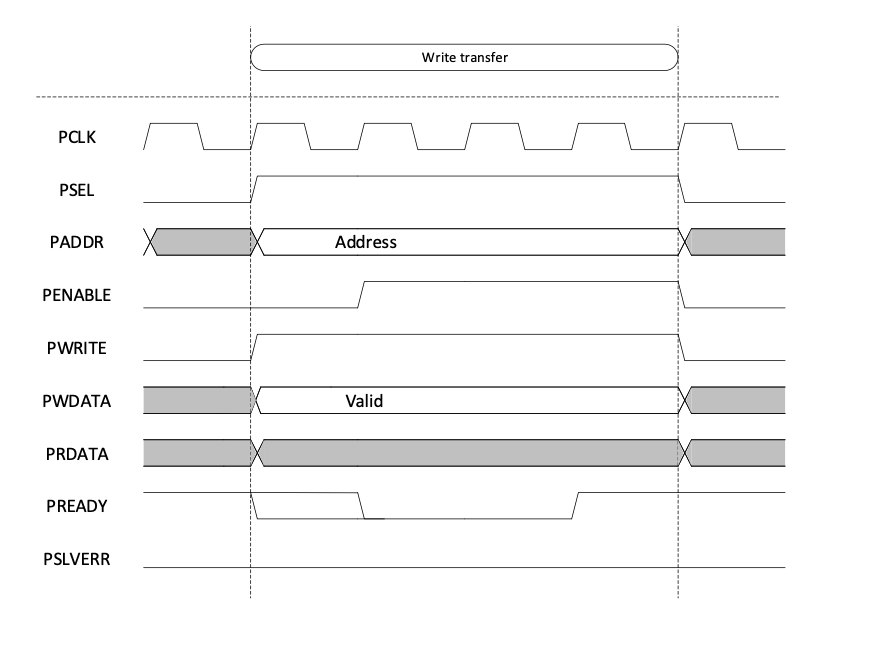
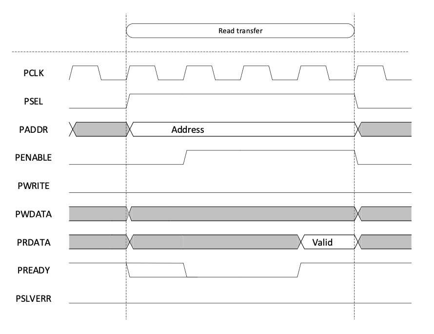
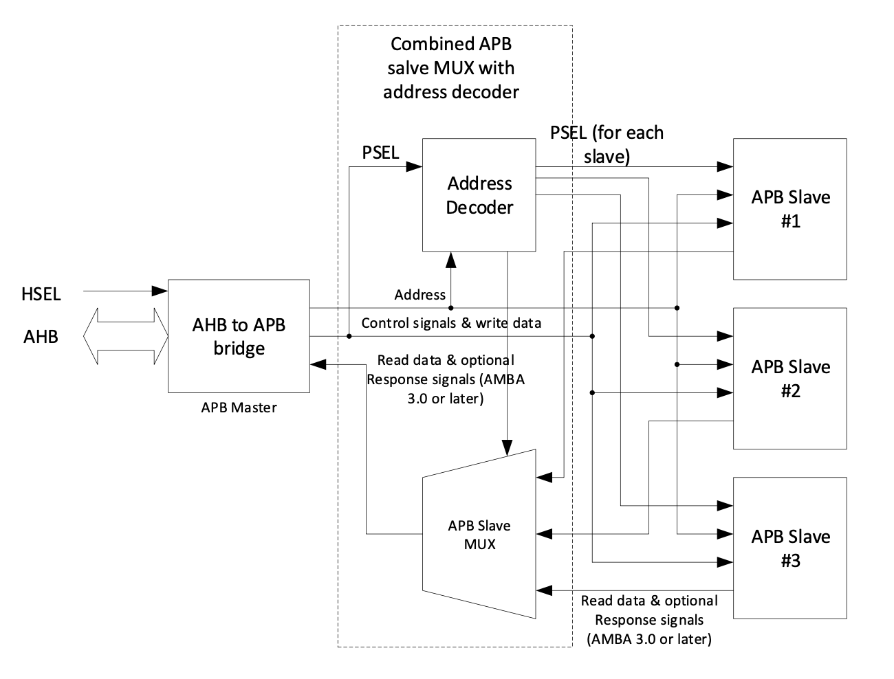

# APB (Advanced Peripheral Bus) Interview Questions and Answers

## 1. What is the APB bus, and where is it used?
APB (Advanced Peripheral Bus) is a low-power, low-bandwidth bus used in the AMBA (Advanced Microcontroller Bus Architecture) for connecting peripheral devices like UART, SPI, I2C, GPIO, and timers. It provides simple interface logic compared to high-performance buses like AHB and AXI.

---

## 2. What are the key signals in APB?
- **PCLK**: APB clock signal.
- **PSEL**: Select signal for enabling communication with a slave.
- **PADDR**: Address signal to select a register in the slave.
- **PWRITE**: Determines if the operation is a **read (0)** or **write (1)**.
- **PWDATA**: Write data bus.
- **PRDATA**: Read data bus.
- **PENABLE**: Indicates the second phase of the APB transfer.
- **PREADY**: Indicates if the slave is ready to complete the transfer.
- **PSLVERR**: Signals an error response from the slave.

---

## 3. What is the APB write transaction sequence?
An APB write transaction consists of two main phases:

### 1️⃣ Address Phase
- The master initiates the transaction by asserting:
  - `PSEL = 1` (Slave Select)
  - `PWRITE = 1` (Write Operation)
  - `PADDR` (Target register address)
  - `PWDATA` (Data to be written)

### 2️⃣ Data Phase
If no wait states are inserted (`PREADY=1` immediately), the Data Phase consists of a single clock cycle where the transaction completes. If the slave requires more time, it inserts wait states, causing the Data Phase to be split into two sub-phases:

#### 2.1 Enable Phase
- The master asserts `PENABLE=1` in the next clock cycle.
- The slave starts processing the write request.
- If the slave is not ready, it holds `PREADY=0`, inserting wait states.

#### 2.2 Completion Phase
- When the slave is ready (`PREADY=1`), the transaction completes:
  - The master deasserts `PENABLE=0`.
  - The write operation is committed to the target register.
  - The bus is ready for the next transaction.

📌 APB Write Transfer Timing Diagram: 

---

## 4. What is the APB read transaction sequence?
An APB read transaction follows the same structure as the write transaction, except that the master reads data instead of writing it.

### 1️⃣ Address Phase
- The master initiates the read transaction by asserting:
  - `PSEL = 1` (Slave Select)
  - `PWRITE = 0` (Read Operation)
  - `PADDR` (Target register address)

### 2️⃣ Data Phase
If no wait states are inserted (`PREADY=1` immediately), the Data Phase completes in one clock cycle. If the slave needs more time, the Data Phase is split into two parts:

#### 2.1 Enable Phase
- The master asserts `PENABLE=1` in the next clock cycle.
- The slave retrieves the requested data.
- If the slave is not ready, it holds `PREADY=0`, inserting wait states.

#### 2.2 Completion Phase
- When the slave has valid data (`PREADY=1`):
  - `PRDATA` contains the requested value.
  - The master deasserts `PENABLE=0`, completing the read.
  - The system is ready for the next transaction.

📌 APB Read Transfer Timing Diagram (with 3 Wait States): 

---

## 5. How does APB differ from AHB and AXI?
- **AHB (Advanced High-performance Bus)**:
  - Supports burst transfers.
  - Pipelined structure.
  - Single master with multiple slaves.
- **AXI (Advanced eXtensible Interface)**:
  - Supports **out-of-order** and **parallel transactions**.
  - Separate **read/write channels**.
  - Higher bandwidth.
- **APB (Advanced Peripheral Bus)**:
  - **No burst support** (single transaction per clock cycle).
  - **Simple, low-power interface** for peripherals.

---

## 6. How does APB fit into an SoC? Explain an APB system.
APB is used to connect low-bandwidth peripherals to a high-performance system bus**. Since APB does not support pipelining or burst transfers, it is typically connected via an AHB-to-APB or AXI-to-APB bridge.

### Components of an APB system:
- **AHB/APB Bridge**: Converts AHB (or AXI) transactions into APB transactions.
- **Address Decoder**: Selects the appropriate APB slave based on `PADDR`.
- **APB Slaves**: Peripheral devices like UART, GPIO, I2C, SPI, timers, etc.

### APB Transfer Flow:
1. AHB/AXI Master initiates a request.**
2. AHB/APB Bridge converts the request to APB format.
3. Address Decoder activates the correct `PSEL` signal for the slave.
4. APB transaction completes using `PENABLE`, `PREADY`, `PWDATA`, and `PRDATA`.

📌 **Example APB System Diagram:**  

---

## 7. What is the role of PREADY in APB?
- **PREADY = 0** → Slave needs more time to process the request.
- **PREADY = 1** → Slave completes the transaction.

---

## 8. Why does APB have two phases (Address + Enable)?
- **Address Phase** allows setup of signals.
- **Enable Phase** ensures data stability.
- This prevents timing hazards and simplifies slave logic.

---

## 9. What happens if `PENABLE` is asserted before `PSEL`?
- The transaction is **invalid**, as `PSEL` must be set first.

---

## 10. What happens if `PREADY` is always high?
- APB transfers will always complete in **one clock cycle**.

---

## 11. What is the function of `PSLVERR` in APB?
- If `PSLVERR=1`, it indicates **an error response** from the slave.

---

## 12. Can APB handle multiple outstanding transactions?
- **No**, APB only supports **one active transaction at a time**.

---

## 13. How does APB handle clock domain crossings?
- Usually **synchronizers** or **bridges** (e.g., AHB to APB bridge) are used.

---

## 14. Why is APB not pipelined?
- APB follows a **simple two-phase protocol**, making it **easier to implement** and **lower in power**.

---

## 15. What is the impact of `PENABLE` deassertion?
- If `PENABLE=0`, the transfer is **not completed**.

---

## 16. Can `PWRITE` change during a transaction?
- **No**, `PWRITE` must remain stable once the transfer starts.

---

## 17. What happens if the slave never asserts `PREADY`?
- The master **waits indefinitely**, causing a **hang**.

---

## 18. How can a master abort an APB transaction?
- By **deasserting `PSEL`**, the transfer is canceled.

---

## 19. How is an APB slave selected?
- The **APB bridge decodes the address (`PADDR`)** and sets `PSEL` accordingly.

---

## 20. What are the main differences between APB3 and APB4?
- **APB3** lacks the `PSTRB` and `PPROT` signals.
- **APB4** adds **byte strobes (`PSTRB`)** for finer control.

---